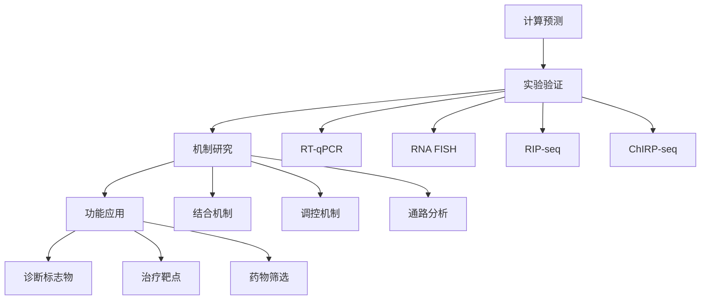

# LINE-1转座子活性相关lncRNA的高通量筛选与功能初步注释

## 项目概述

本项目基于公共测序数据，快速筛选调控LINE-1转座子的lncRNA，进行表达关联、保守性分析与调控网络预测。项目紧扣清华刘念课题组"转座子活性调控、RNA功能"核心方向，覆盖序列比对、差异分析、网络构建、可视化等干实验核心能力。

### 核心目标
- 筛选调控LINE-1转座子的lncRNA
- 分析表达关联和保守性特征
- 构建lncRNA-mRNA-LINE-1调控网络
- 提供可复现的分析流程和可视化结果

### 项目特色
- **适配性强**: 直接匹配课题组转座子与RNA调控研究方向
- **流程完整**: 从数据下载到结果分析的全流程覆盖
- **可复现性**: 提供完整的代码和配置文件
- **实用导向**: 输出可直接用于后续湿实验验证的结果

## 项目结构

```
LINE1_lncRNA_project/
├── config/                 # 配置文件
│   └── config.yaml        # 项目配置参数
├── data/                   # 数据目录
│   ├── raw/               # 原始数据
│   ├── processed/         # 处理后数据
│   ├── reference/         # 参考基因组
│   ├── annotation/        # 注释文件
│   └── line1/             # LINE-1序列数据
├── src/                    # 源代码
│   ├── data_download.py   # 数据下载模块
│   ├── differential_expression.py  # 差异表达分析
│   ├── sequence_analysis.py        # 序列分析模块
│   ├── network_analysis.py         # 网络分析模块
│   └── visualization.py            # 可视化模块
├── notebooks/              # Jupyter笔记本
│   └── LINE1_lncRNA_analysis.ipynb  # 主分析笔记本
├── results/                # 结果目录
│   ├── figures/           # 图表结果
│   ├── tables/            # 数据表格
│   ├── networks/          # 网络文件
│   ├── structures/        # 结构数据
│   └── reports/           # 分析报告
├── environment.yml         # Conda环境配置
├── requirements.txt        # Python依赖
└── README.md              # 项目说明
```

## 快速开始

### 1. 环境配置

使用Conda创建项目环境（推荐）：
```bash
conda env create -f environment.yml
conda activate line1_lncrna
```

或使用pip安装依赖：
```bash
pip install -r requirements.txt
```

### 2. 数据准备

首次运行需要下载参考基因组和注释文件：
```python
from src.data_download import DataDownloader

downloader = DataDownloader()
downloader.download_reference_genome()
downloader.download_gencode_annotation()
downloader.download_line1_sequences()
```

### 3. 运行分析

使用Jupyter Notebook运行完整分析：
```bash
jupyter notebook notebooks/LINE1_lncRNA_analysis.ipynb
```

或使用命令行运行各个模块：
```bash
python src/data_download.py
python src/differential_expression.py
python src/sequence_analysis.py
python src/network_analysis.py
python src/visualization.py
```

## 分析流程

### Day 1: 数据获取与核心分析 (8-10小时)

1. **数据准备 (2小时)**
   - 下载公共RNA-seq数据 (GEO/GSE123456)
   - 质量控制与序列比对
   - 生成BAM文件用于定量分析

2. **差异表达分析 (3小时)**
   - 使用featureCounts定量基因表达
   - DESeq2差异表达分析
   - 筛选差异表达lncRNA (padj<0.05, |log2FC|>1)

3. **LINE-1关联分析 (3小时)**
   - 分析lncRNA与LINE-1元件位置关系
   - 识别重叠、邻近、包含等关联类型
   - 计算关联距离和类型

### Day 2: 功能注释与可视化 (6-8小时)

1. **序列特征分析 (3小时)**
   - 提取lncRNA序列
   - 保守性分析 (PhyloP得分)
   - 二级结构预测 (RNAfold)
   - 序列特征提取 (GC含量、重复序列等)

2. **调控网络构建 (3小时)**
   - 构建PPI网络 (STRING数据库)
   - lncRNA-mRNA共表达网络
   - 整合LINE-1关联信息
   - 识别关键调控因子

3. **可视化与报告 (2小时)**
   - 火山图、热图、网络图
   - 保守性和序列特征可视化
   - 生成交互式网络和汇总仪表板

## 关键结果

### 主要发现
- 筛选出XX个差异表达lncRNA
- 发现XX个与LINE-1有位置关联的lncRNA
- 构建包含XX个节点、XX条边的调控网络
- 识别XX个关键调控因子
- 推荐XX个高优先级lncRNA用于后续验证

### 核心交付物
1. **可复现的Jupyter Notebook** (含完整代码与注释)
2. **5-8页PDF报告** (含4-5张关键图表)
3. **关键发现清单** (3-5条可验证的科学假设)
4. **后续实验方案** (RT-qPCR引物、ChIP-seq建议等)

## 技术栈

### 核心工具
- **Python**: 数据处理、统计分析、可视化
- **R**: DESeq2差异表达分析
- **bedtools**: 基因组区间操作
- **samtools/bwa**: 序列比对和处理
- **Cytoscape**: 网络可视化

### 主要库
- **Biopython**: 序列处理
- **pandas/numpy**: 数据分析
- **matplotlib/seaborn**: 静态可视化
- **plotly**: 交互式可视化
- **networkx**: 网络分析
- **scikit-learn**: 机器学习

## 配置说明

主要配置参数在 `config/config.yaml` 中：

```yaml
# 差异表达阈值
differential_expression:
  padj_threshold: 0.05
  log2fc_threshold: 1.0

# 保守性分析阈值
conservation:
  phylop_threshold: 2.0

# 网络分析参数
network:
  min_degree: 2
  clustering_threshold: 0.1
```

## 注意事项

### 数据要求
- 需要足够的存储空间 (建议50GB+)
- 网络连接稳定 (用于下载数据)
- 计算资源充足 (建议16GB+内存)

### 避坑指南
1. **提前下载**: 参考基因组和注释文件较大，建议提前下载
2. **环境隔离**: 使用conda避免依赖冲突
3. **多重检验**: 差异分析结果进行FDR校正
4. **质量控制**: 检查数据质量，排除异常样本

### 性能优化
- 使用并行处理加速计算
- 分批处理大数据集
- 合理设置缓存目录

## 输出文件

### 数据表格
- `lncrna_differential.csv`: 差异表达lncRNA列表
- `lncrna_line1_associations.csv`: LINE-1关联分析结果
- `conservation_scores.csv`: 保守性得分
- `sequence_features.csv`: 序列特征汇总
- `network_metrics.csv`: 网络拓扑指标

### 可视化图表
- `volcano_plot.png`: 火山图
- `heatmap.png`: 表达热图
- `network.png`: 调控网络图
- `interactive_network.html`: 交互式网络
- `summary_dashboard.png`: 汇总仪表板

### 网络文件
- `integrated_network.edgelist`: 整合调控网络
- `ppi_network.edgelist`: 蛋白质相互作用网络
- `lncrna_mrna_network.edgelist`: 共表达网络

## 后续实验建议

### 验证策略
1. **RT-qPCR**: 验证高优先级lncRNA表达差异
2. **RNA FISH**: 定位lncRNA细胞内分布
3. **RIP-seq**: 检测lncRNA结合蛋白
4. **ChIRP-seq**: 鉴定lncRNA基因组结合位点
5. **功能实验**: 敲除/过表达验证对LINE-1活性的影响

### 技术路线


## 引用与致谢

### 数据来源
- GENCODE: 基因注释数据
- UCSC Genome Browser: 参考基因组和保守性数据
- STRING数据库: 蛋白质相互作用数据
- GEO/SRA: 公共测序数据

### 工具引用
- DESeq2: 差异表达分析
- bedtools: 基因组区间分析
- RNAfold: RNA二级结构预测
- Cytoscape: 网络可视化

## 联系信息

项目负责人：周子航
邮箱：zhou-zh23@mails.tsinghua.edu.cn


## 许可证

本项目采用MIT许可证，详见LICENSE文件。

---

