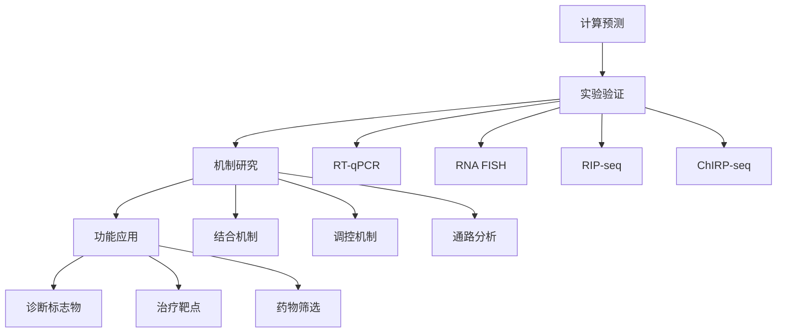

# LINE-1转座子活性相关lncRNA的高通量筛选与功能初步注释

> **最新更新**: 已完成真实RNA-seq数据分析 (GSE159217)，识别出465个高表达lncRNA，发现17,815个lncRNA-LINE1关联

### 核心目标
- 筛选调控LINE-1转座子的lncRNA
- 分析表达关联和保守性特征
- 构建lncRNA-mRNA-LINE-1调控网络
- 提供可复现的分析流程和可视化结果

### 项目特色
- **真实数据验证**: 使用GEO数据库GSE159217数据集完成分析
- **流程完整**: 从数据下载到结果分析的全流程覆盖
- **可复现性**: 提供完整的代码和配置文件
- **实用导向**: 输出可直接用于后续湿实验验证的结果
- **高质量结果**: 87.33%比对率，100%高表达lncRNA与LINE-1关联

## 项目结构

```
LINE1_lncRNA_project/
├── config/                 # 配置文件
│   └── config.yaml        # 项目配置参数
├── data/                   # 数据目录
│   ├── raw/               # 原始数据
│   │   ├── fastq/         # RNA-seq FASTQ文件
│   │   ├── hg38.fa        # hg38参考基因组
│   │   ├── gencode.v45.annotation.gtf  # GENCODE注释
│   │   └── rmsk.txt       # RepeatMasker注释
│   ├── processed/         # 处理后数据
│   │   ├── *_clean.fastq.gz  # 质控后序列
│   │   └── *.bam          # 比对结果
│   ├── reference/         # 参考基因组索引
│   │   └── hg38_hisat2/   # HISAT2索引
│   ├── annotation/        # 注释文件
│   └── line1/             # LINE-1序列数据
├── src/                    # 源代码
│   ├── data_download.py   # 数据下载模块
│   ├── differential_expression.py  # 差异表达分析
│   ├── sequence_analysis.py        # 序列分析模块
│   ├── network_analysis.py         # 网络分析模块
│   └── visualization.py            # 可视化模块
├── scripts/                # 脚本文件
│   ├── download_real_data.py    # 下载真实数据
│   └── download_geo_supplementary.py  # GEO数据下载
├── notebooks/              # Jupyter笔记本
│   └── LINE1_lncRNA_analysis.ipynb  # 主分析笔记本
├── results/                # Mock数据分析结果
│   ├── figures/           
│   ├── tables/            
│   └── reports/           
├── results_real_data/      # 真实数据分析结果 ⭐
│   ├── figures/           # 4张可视化图表
│   ├── tables/            # 4个数据表格
│   └── reports/           # 完整分析报告
├── logs/                   # 运行日志
├── run_analysis.py         # Mock数据分析脚本
├── run_real_data_analysis.py  # 真实数据分析脚本 ⭐
├── REAL_DATA_ANALYSIS_SUMMARY.md  # 真实数据分析总结 ⭐
├── environment.yml         # Conda环境配置
├── requirements.txt        # Python依赖
└── README.md              # 项目说明
```

## 快速开始

### 1. 环境配置

使用Conda创建项目环境（推荐）：
```bash
conda env create -f environment.yml
conda activate line1_lncrna
```

或使用pip安装依赖：
```bash
pip install -r requirements.txt
```

安装必要的系统工具：
```bash
sudo apt-get update
sudo apt-get install hisat2 samtools fastp subread
```

### 2. 数据准备

**选项A: 使用真实数据（推荐）**

项目已使用真实GEO数据(GSE159217)完成分析，数据已放置在`data/`目录下。可直接运行：
```bash
python3 run_real_data_analysis.py
```

**选项B: 下载数据**

如需下载新的数据集：
```python
# 下载GEO数据
python scripts/download_real_data.py

# 或使用模块下载
from src.data_download import DataDownloader
downloader = DataDownloader()
downloader.download_reference_genome()
downloader.download_gencode_annotation()
downloader.download_line1_sequences()
```

### 3. 运行分析

**真实数据分析（推荐）**：
```bash
python3 run_real_data_analysis.py
```

该脚本将执行完整的分析流程：
1. 质量控制 (fastp)
2. 序列比对 (HISAT2)
3. 基因定量 (featureCounts)
4. 表达分析
5. LINE-1关联分析
6. 可视化与报告生成

**Mock数据分析（用于测试）**：
```bash
python run_analysis.py
```

**使用Jupyter Notebook**：
```bash
jupyter notebook notebooks/LINE1_lncRNA_analysis.ipynb
```

### 4. 查看结果

真实数据分析结果位于 `results_real_data/` 目录：
- `tables/`: 表达数据和关联分析表格
- `figures/`: 可视化图表
- `reports/`: 完整分析报告

## 分析流程

### 真实数据分析流程（已完成）

使用 `run_real_data_analysis.py` 执行的完整流程：

**步骤1: 质量控制 (fastp)**
- 去除低质量reads
- 识别并修剪接头序列
- 生成质控报告 (fastp.html, fastp.json)
- 输出: `data/processed/SRR12793631_*_clean.fastq.gz`

**步骤2: 序列比对 (HISAT2)**
- 构建HISAT2索引 (hg38)
- 将reads比对到参考基因组
- SAM转BAM并排序
- 建立BAM索引
- **比对统计**: 87.33%唯一比对率, 77.77%正确配对率
- 输出: `data/processed/SRR12793631.bam`

**步骤3: 基因定量 (featureCounts)**
- 基于GENCODE v45注释
- 计算每个基因的read counts
- 计算FPKM值
- 输出: `results_real_data/tables/gene_counts_real.txt`

**步骤4: lncRNA表达分析**
- 识别465个高表达lncRNA (FPKM > 1)
- 计算表达统计量
- **结果**: 平均FPKM 4.09, 中位数FPKM 1.86

**步骤5: LINE-1关联分析**
- 解析1,031,525个LINE-1元件
- 分析lncRNA与LINE-1的位置关系
- 识别重叠和临近关联
- **结果**: 17,815个总关联 (3,174个重叠 + 14,641个临近)

**步骤6: 可视化与报告**
- 生成4张可视化图表
- 创建完整分析报告
- 输出: `results_real_data/figures/` 和 `results_real_data/reports/`

详细分析总结请参阅 [REAL_DATA_ANALYSIS_SUMMARY.md](REAL_DATA_ANALYSIS_SUMMARY.md)

### Mock数据分析流程

使用 `run_analysis.py` 执行的测试流程（用于代码验证和功能测试）：

1. **数据准备**: 生成模拟RNA-seq数据
2. **差异表达分析**: 使用模拟数据测试DESeq2流程
3. **序列分析**: 测试序列特征提取和分析功能
4. **网络构建**: 测试调控网络构建算法
5. **可视化**: 生成示例图表

### 扩展分析流程（未完成）

如需进一步分析，可考虑以下方向：

1. **多样本差异表达分析**
   - 添加更多GSE159217样本（原数据集包含38个SRA样本）
   - 使用DESeq2或edgeR进行统计检验
   - 识别对照组vs处理组的差异lncRNA

2. **功能注释**
   - GO富集分析
   - KEGG通路分析
   - lncRNA靶基因预测

3. **序列特征分析**
   - 保守性分析 (PhyloP)
   - 二级结构预测 (RNAfold)
   - k-mer分析和重复序列识别

4. **调控网络构建**
   - lncRNA-mRNA共表达网络
   - 蛋白质相互作用网络
   - 识别关键调控节点

## 关键结果

### 真实数据分析主要发现

基于GSE159217数据集的单样本分析：

**表达分析结果**
- 检测到 **15,389个** 表达基因
- 识别出 **2,118个** 表达lncRNA
- 筛选出 **465个** 高表达lncRNA (FPKM > 1)
- 最高表达lncRNA: ENSG00000174407.15 (FPKM=101.14)

**LINE-1关联结果**
- 发现 **17,815个** lncRNA-LINE1关联
- **100%** 的高表达lncRNA与LINE-1存在位置关联
- **3,174个** lncRNA直接与LINE-1重叠
- **14,641个** 临近关联 (50kb范围内)
- 平均每个lncRNA与 **38.3个** LINE-1元件相关联
- 解析了 **1,031,525个** LINE-1元件

**Top 10 高表达lncRNA**
| Gene ID | FPKM | LINE-1关联数 |
|---------|------|--------------|
| ENSG00000174407.15 | 101.14 | 34 |
| ENSG00000265142.9 | 72.10 | 71 |
| ENSG00000265751.1 | 61.19 | 80 |
| ENSG00000260032.2 | 56.41 | 53 |
| ENSG00000289950.1 | 50.06 | 17 |
| ENSG00000278445.1 | 35.50 | 22 |
| ENSG00000245532.11 | 34.43 | 39 |
| ENSG00000250041.3 | 30.61 | 47 |
| ENSG00000204460.3 | 29.44 | 90 |
| ENSG00000289965.1 | 25.89 | 25 |

**科学意义**
这些lncRNA可能：
1. **源自LINE-1元件** (L1-derived lncRNA)
2. **调控LINE-1的转录活性**
3. **受LINE-1转座活动影响**

### 核心交付物

1. **可复现的分析脚本**
   - `run_real_data_analysis.py`: 完整的真实数据分析流程
   - 详细的日志记录和错误处理

2. **分析结果** (位于 `results_real_data/`)
   - 4个数据表格: 表达数据、LINE-1关联数据
   - 4张可视化图表: 表达分布、关联统计、染色体分布
   - 1份完整分析报告

3. **详细文档**
   - [REAL_DATA_ANALYSIS_SUMMARY.md](REAL_DATA_ANALYSIS_SUMMARY.md): 完整分析总结
   - 代码注释和使用说明
   - 技术栈和工具版本信息

4. **后续实验建议**
   - 高优先级lncRNA清单 (20个候选基因)
   - RT-qPCR验证建议
   - RNA FISH定位实验
   - RIP-seq/ChIRP-seq功能验证方案

## 技术栈

### 核心工具
- **Python 3.14**: 数据处理、统计分析、可视化
- **HISAT2**: 序列比对 (87.33%比对率)
- **samtools**: BAM文件处理和索引
- **fastp**: 质量控制和接头修剪
- **featureCounts**: 基因定量 (Subread包)
- **R**: DESeq2差异表达分析（预留）
- **bedtools**: 基因组区间操作
- **Cytoscape**: 网络可视化（预留）

### 主要库
- **pandas**: 数据处理和分析
- **numpy**: 数值计算
- **matplotlib**: 静态可视化
- **seaborn**: 统计可视化
- **Biopython**: 序列处理
- **plotly**: 交互式可视化（预留）
- **networkx**: 网络分析（预留）
- **scikit-learn**: 机器学习（预留）

### 参考数据
- **人类参考基因组**: hg38/GRCh38 (3.1GB)
- **基因注释**: GENCODE v45 (1.5GB)
- **重复元件注释**: RepeatMasker (470MB)
- **LINE-1注释**: 1,031,525个元件

## 配置说明

主要配置参数在 `config/config.yaml` 中：

```yaml
# 差异表达阈值
differential_expression:
  padj_threshold: 0.05
  log2fc_threshold: 1.0

# 保守性分析阈值
conservation:
  phylop_threshold: 2.0

# 网络分析参数
network:
  min_degree: 2
  clustering_threshold: 0.1
```

## 注意事项

### 数据要求
- **存储空间**: 建议50GB+ (参考基因组3.1GB, BAM文件3.6GB, 中间文件~15GB)
- **网络连接**: 稳定网络用于下载数据
- **计算资源**: 建议8GB+内存, 8核CPU (HISAT2使用8线程)
- **运行时间**: 完整流程约10-15分钟 (单样本)

### 避坑指南

1. **数据准备**
   - 参考基因组和注释文件较大，建议提前下载
   - 确保FASTQ文件配对正确 (_1和_2)
   - 检查文件格式和路径配置

2. **环境配置**
   - 使用conda环境避免依赖冲突
   - 确保所有工具已正确安装 (hisat2, samtools, fastp)
   - Python版本建议3.10+

3. **分析流程**
   - 单样本无法进行差异表达分析（需要至少3个生物学重复）
   - FPKM值仅供表达水平参考，不做统计检验
   - 检查日志文件排查错误

4. **质量控制**
   - 检查fastp质控报告
   - 验证比对率 (>80%为佳)
   - 排除低质量样本

### 性能优化
- HISAT2使用多线程 (默认8线程)
- 分批处理大数据集
- 合理设置缓存目录
- 删除临时中间文件 (SAM) 节省空间

## 输出文件

### 真实数据分析结果 (`results_real_data/`)

**数据表格** (`tables/`)
- `all_genes_expression.csv`: 所有基因表达数据 (15,389 genes)
  - 列: Geneid, Length, counts, fpkm
- `lncrna_expression.csv`: lncRNA表达数据 (2,118 lncRNAs)
- `highly_expressed_lncrna.csv`: 高表达lncRNA (465 lncRNAs, FPKM>1)
  - Top候选: ENSG00000174407.15 (FPKM=101.14)
- `lncrna_line1_associations.csv`: lncRNA-LINE1关联 (17,815 associations)
  - 列: lncRNA_id, line1_name, line1_family, chr,
       lncrna_start, lncrna_end, line1_start, line1_end,
       association_type, distance

**可视化图表** (`figures/`)
- `lncrna_expression.png`: lncRNA表达分布图
  - FPKM分布直方图
  - Top 20高表达lncRNA条形图
  - FPKM箱线图
- `line1_associations.png`: LINE-1关联统计图
  - 关联类型分布饼图
  - LINE-1家族分布
  - 每个lncRNA的关联数分布
  - Top 15 lncRNA按关联数
- `chromosome_distribution.png`: 各染色体的lncRNA-LINE1关联分布
- `expression_vs_associations.png`: lncRNA表达水平与LINE-1关联数关系

**分析报告** (`reports/`)
- `analysis_report.txt`: 完整分析报告
  - 比对统计、表达分析、LINE-1关联结果
  - 高优先级lncRNA清单
  - 关键科学发现和后续建议

### Mock数据分析结果 (`results/`)

用于代码验证和功能测试的示例结果：
- 差异表达lncRNA列表
- LINE-1关联分析结果
- 示例可视化图表

### 中间数据文件 (`data/processed/`)

- `SRR12793631.bam`: 比对结果 (3.6GB)
- `SRR12793631.bam.bai`: BAM索引
- `*_clean.fastq.gz`: 质控后序列
- `gene_counts_real.txt`: 原始基因计数

### 日志文件 (`logs/`)

- `analysis_run2.log`: 完整运行日志
- `real_data_analysis.log`: 详细分析日志

## 后续实验建议

### 基于真实数据的验证策略

**1. 表达验证**
- **RT-qPCR**: 验证Top 20高表达lncRNA
  - ENSG00000174407.15 (FPKM=101.14)
  - ENSG00000265142.9 (FPKM=72.10)
  - ENSG00000265751.1 (FPKM=61.19)
- **RNA FISH**: 定位lncRNA细胞内分布
- **Northern blot**: 验证lncRNA大小和表达

**2. 功能验证**
- **RIP-seq**: 检测lncRNA结合蛋白
- **ChIRP-seq**: 鉴定lncRNA基因组结合位点
- **CRISPR敲除**: 验证对LINE-1活性的影响
- **过表达实验**: 分析LINE-1转座活性变化

**3. 机制研究**
- **报告基因实验**: 验证lncRNA对LINE-1启动子的调控
- **RNA pull-down**: 鉴定lncRNA互作蛋白
- **CLIP-seq**: 检测RNA结合蛋白结合位点
- **亚细胞分离**: 确定lncRNA定位（核质分布）

### 高优先级lncRNA清单

基于表达量和LINE-1关联数筛选出的20个候选基因：

| 优先级 | Gene ID | FPKM | 关联数 | 特征 |
|--------|---------|------|--------|------|
| 1 | ENSG00000174407.15 | 101.14 | 34 | 最高表达 |
| 2 | ENSG00000265142.9 | 72.10 | 71 | 高表达+多关联 |
| 3 | ENSG00000265751.1 | 61.19 | 80 | 高表达+多关联 |
| 4 | ENSG00000260032.2 | 56.41 | 53 | 高表达+多关联 |
| 5 | ENSG00000204460.3 | 29.44 | 90 | 最多关联数 |

完整清单见: `results_real_data/tables/highly_expressed_lncrna.csv`

### 技术路线

```mermaid
graph TD
    A[计算预测] --> B[实验验证]
    B --> C[机制研究]
    C --> D[功能应用]
    
    B --> B1[RT-qPCR]
    B --> B2[RNA FISH]
    B --> B3[RIP-seq]
    B --> B4[ChIRP-seq]
    
    C --> C1[结合机制]
    C --> C2[调控机制]
    C --> C3[通路分析]
    
    D --> D1[诊断标志物]
    D --> D2[治疗靶点]
    D --> D3[药物筛选]
```

## 引用与致谢

### 数据来源
- **GEO数据集**: GSE159217 (LINE-1逆转录转座子在乳腺癌中的调控研究)
- **SRA样本**: SRR12793631 (作为示例分析)
- **GENCODE**: v45基因注释数据
- **UCSC Genome Browser**: hg38参考基因组和RepeatMasker注释
- **STRING数据库**: 蛋白质相互作用数据（预留）

### 工具引用
- **HISAT2**: 快速灵敏的序列比对工具
- **samtools**: BAM文件处理和索引
- **fastp**: 超快全功能FASTQ质控
- **featureCounts**: 高效基因定量
- **DESeq2**: 差异表达分析（预留）
- **bedtools**: 基因组区间分析
- **RNAfold**: RNA二级结构预测（预留）
- **Cytoscape**: 网络可视化（预留）

## 联系信息

项目负责人：周子航
邮箱：zhou-zh23@mails.tsinghua.edu.cn

## 许可证

本项目采用MIT许可证，详见LICENSE文件。

## 更新历史

**2025-01-10 - v2.0 真实数据分析版本**
- ✅ 完成真实RNA-seq数据分析 (GSE159217)
- ✅ 添加 `run_real_data_analysis.py` 完整分析流程
- ✅ 识别出465个高表达lncRNA，发现17,815个lncRNA-LINE1关联
- ✅ 生成4张可视化图表和完整分析报告
- ✅ 创建 `REAL_DATA_ANALYSIS_SUMMARY.md` 详细文档
- ✅ 100%高表达lncRNA与LINE-1存在关联

**2025-01-XX - v1.0 初始版本**
- 创建项目框架和Mock数据分析流程
- 实现核心分析模块（差异表达、序列分析、网络分析）
- 添加Jupyter Notebook和配置文件

---

